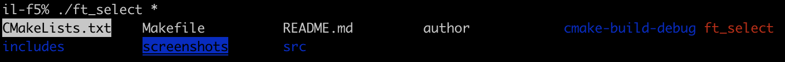

[](https://42.fr/)


# ft_select



`ft_select` is an interactive terminal program developed in C as part of the 42 School curriculum. This project involves building a custom user interface in a raw terminal environment, allowing users to navigate and select items passed via the command line. It explores low-level terminal handling using the termcap library and system calls that give fine-grained control over terminal behavior.

## Project Overview

- **Language:** C
- **Executable:** `ft_select`
- **Objective:** Create a responsive text-based interface that processes real-time input and adapts to terminal constraints.
- **Core Topics:**
  - Terminal configuration using `termios`
  - Terminal display control via `termcap`
  - Input capture in non-canonical mode (e.g., arrows, esc, fn keys)
  - Signal handling and cleanup
  - Low-level I/O and memory safety
- [Original task](static/ft_select.en.pdf)
- [Original task (fr)](static/ft_select_intro.fr.pdf)

## Goals

This project introduces the concepts of terminal control beyond basic input/output. You will learn:
- How terminals buffer and manage input under normal circumstances
- How to disable canonical mode and echo to handle raw input directly
- How to capture complex keys like arrow keys and escape sequences
- How to write an application that redraws its UI responsively and exits cleanly
- How to handle UNIX signals (e.g., `SIGWINCH`, `SIGTSTP`, `SIGCONT`)
- Why terminal programming is powerful but non-trivial

## Features

- **Interactive Item Selection:** Navigate a list of arguments and select them using the keyboard
- **Keyboard Support:** Arrow keys, space, tab, enter, esc
- **Responsive UI:** Automatically adjusts to window resizing
- **Signal Support:** Suspend/resume behavior with correct redraw
- **Memory-Safe:** No leaks, stable exit, proper cleanup

## Usage

```bash
$ make
$ ./ft_select item1 item2 item3 ...
```

### Controls

| Key              | Action                     |
|------------------|----------------------------|
| Up / Down Arrow  | Move selection cursor      |
| Space / Tab      | Toggle item selection      |
| Enter            | Confirm and print selection |
| Esc / Ctrl-C     | Exit without selection     |

## Compilation

```bash
make
```

### Makefile Targets

| Target   | Description                     |
|----------|---------------------------------|
| `all`    | Build the `ft_select` binary     |
| `clean`  | Remove object files              |
| `fclean` | Remove object files and binary   |
| `re`     | Rebuild the project from scratch |

## Constraints

- Must use `termcap` (ncurse is forbidden)
- Only specified libc/system functions allowed (e.g., `tcgetattr`, `tputs`, `ioctl`, `read`)
- No global variables (except for signal handling)
- No crashes or memory leaks
- Must restore terminal to original state upon exit

## License
This project is developed for educational purposes as part of the 42 School program.

